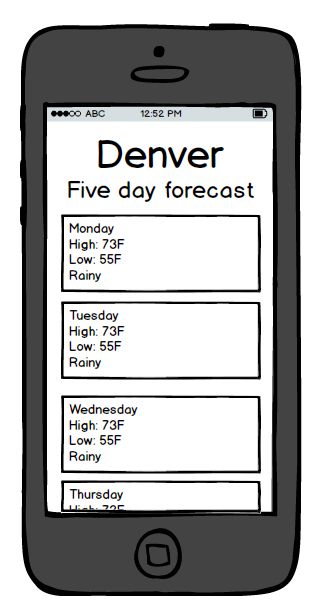

Shows the five day forecast for Denver, Colorado.

The app is built in Angular.js with UI Router. Gulp is used to run tasks that build the Javascript and Sass from source. The Javascript is bundled using Webpack. BrowserSync helps during development by refreshing the browser on changes.

Browsers don't like to serve "mixed content", i.e. content served over both http and https. The Open Weather API does not offer an https option (at least as far as I can tell), which created a problem when I deployed to Firebase, which serves over https. I fixed the issue by creating a server that wraps the API and responds to requests over https. [The code for that server can be found here](https://github.com/BillyZac/weather-api).

## Deployed site
[The app is deployed here](https://weather-vane.firebaseapp.com/#/).

## Wireframe
I started by drawing a wireframe. Simple though it may be, it was very helpful to make these design decisions up front. I decided to take a mobile first approach.



## Installation and usage
Dependencies are managed using npm, so after cloning, run:

```
npm install
```

Then we'll build from _source_, fire up a local server, and open a browser using gulp. To do so, run:

```
gulp start
```

This will also refresh the browser whenever the code is changed.

## Running tests with Protractor
Protractor tests are set to run with the command

```
npm test
```

This will start up the app in a browser (or two) and test that specified features is working as expected.

The tests are spelled out _spec.js_ files, such as _src/app/forecast.spec.js_.

Note that the tests require that the app is running, so be sure to start up the app before running the tests.
